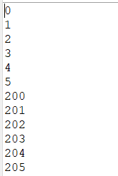
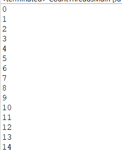
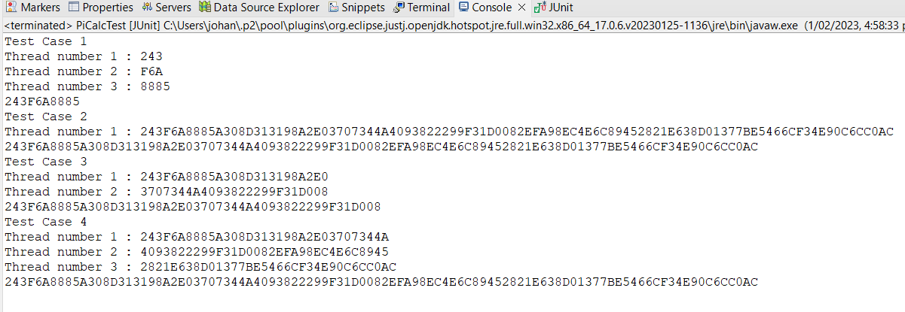
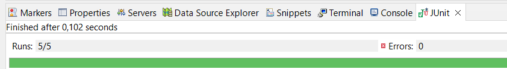

## Escuela Colombiana de Ingeniería
### Arquitecturas de Software
### Introducción al paralelismo - hilos

### Trabajo individual o en parejas

Entrega: Martes en el transcurso del día.
Entregar: Fuentes y documento PDF con las respuestas.

**Parte I Hilos Java**

1. De acuerdo con lo revisado en las lecturas, complete las clases CountThread, para que las mismas definan el ciclo de vida de un hilo que imprima por pantalla los números entre A y B.

```java
	public class CountThread extends Thread {
	private final int in;
	private final int out;
	
	public CountThread(int in, int out) {
		this.in = in;
		this.out = out;	
	}
    
	@Override
	public void run() {
		for (int i = in; i <= out; i++) {
			System.out.println(i);
		}
	}
```
2. Complete el método __main__ de la clase CountMainThreads para que:
	1. Cree 3 hilos de tipo CountThread, asignándole al primero el intervalo [0..99], al segundo [99..199], y al tercero [200..299].
	```java
		public static void main(String a[]){
    	CountThread T1 = new CountThread(0,99);
    	CountThread T2 = new CountThread(100,199);
    	CountThread T3 = new CountThread(200,299);        
    }
	```
	2. Inicie los tres hilos con 'start()'.
	```java
		public static void main(String a[]){
    	CountThread T1 = new CountThread(0,99);
    	CountThread T2 = new CountThread(100,199);
    	CountThread T3 = new CountThread(200,299);    
		T1.start();
		T2.start();
		T3.start();    
    }
	```
	3. Ejecute y revise la salida por pantalla. 
	
	4. Cambie el incio con 'start()' por 'run()'. Cómo cambia la salida?, por qué?.
	```java
		public static void main(String a[]){
    	CountThread T1 = new CountThread(0,99);
    	CountThread T2 = new CountThread(100,199);
    	CountThread T3 = new CountThread(200,299);    
		T1.run();
		T2.run();
		T3.run();    
    }
	```
	

	**La diferencia entre utilizar el método start() y el método run() es que  


**Parte II Hilos Java**

La fórmula [BBP](https://en.wikipedia.org/wiki/Bailey%E2%80%93Borwein%E2%80%93Plouffe_formula) (Bailey–Borwein–Plouffe formula) es un algoritmo que permite calcular el enésimo dígito de PI en base 16, con la particularidad de no necesitar calcular nos n-1 dígitos anteriores. Esta característica permite convertir el problema de calcular un número masivo de dígitos de PI (en base 16) a uno [vergonzosamente paralelo](https://en.wikipedia.org/wiki/Embarrassingly_parallel). En este repositorio encontrará la implementación, junto con un conjunto de pruebas. 

Para este ejercicio se quiere calcular, en el menor tiempo posible, y en una sola máquina (aprovechando las características multi-core de la mismas) al menos el primer millón de dígitos de PI (en base 16). Para esto

1. Cree una clase de tipo Thread que represente el ciclo de vida de un hilo que calcule una parte de los dígitos requeridos.
**Solución**

El constructor de la clase ThreadCalculate recibe tres parámetros, los cuales son el nombre o numero de thread ***(NameOfThread)***  que utilizamos para poder identificar cada Hilo y su resultado, además de el valor entero ***(a)*** que indica el punto de partida del hilo y el valor entero ***(b)*** que indica el final o número de valores que el hilo debe ocupar
```java
	public class ThreadCalculate extends Thread{
		
		private final int start;
		private final int last;
		private String thread;
		private String result;
		
		public ThreadCalculate(String NameOfThread ,int a, int b) {
			this.start = a;
			this.last = b;
			this.thread = NameOfThread;
		}
		
		@Override
		public void run() {
	//		Iniciamos un nuevo grupo de digitos vacío
			byte[] digits;
	//		invocamos la función que obtiene los digitos dado un rango y el resultado lo guardamos en el array creado antes
			digits = PiDigits.getDigits(start, last);
	//		En la variable result guardamos el resultado de cambiar este valor de digitos a hexadecimal
			this.result = PiDigits.bytesToHex(digits);
		}	
```
2. Haga que la función PiDigits.getDigits() reciba como parámetro adicional un valor N, correspondiente al número de hilos entre los que se va a paralelizar la solución. Haga que dicha función espere hasta que los N hilos terminen de resolver el problema para combinar las respuestas y entonces retornar el resultado. Para esto, revise el método [join](https://docs.oracle.com/javase/tutorial/essential/concurrency/join.html) del API de concurrencia de Java.

**Solución**

Para realizar este ejercicio utilizamos la clase ***PiDigits***  Como orquestador , enviandole al constructor el parámetro N Que indica la cantidad de hilos que debe utilizar el programa y así creamos una clase aparte ***(Orchestor())*** El cual se encarga de crear todos los hilos y arrancarlos así obteniendo y retornando el resultado esperado

```java
	package edu.eci.arsw.math;

	///  <summary>
	///  An implementation of the Bailey-Borwein-Plouffe formula for calculating hexadecimal
	///  digits of pi.
	///  https://en.wikipedia.org/wiki/Bailey%E2%80%93Borwein%E2%80%93Plouffe_formula
	///  *** Translated from C# code: https://github.com/mmoroney/DigitsOfPi ***
	///  </summary>
	public class PiDigits {

		private static int DigitsPerSum = 8;
		private static double Epsilon = 1e-17;
		private int N = 0;
		private final int[] EachThread;
		private int digits = 0;
		
		
		public PiDigits(int digits,int N) {
			this.N = N;
			this.digits = digits;
			this.EachThread = new int[N];
			int pair = digits / N;
			int odd = digits % N;
			for(int i = 0; i < N; i++) {
				if(i+1 == N) {
					this.EachThread[i]=pair+odd;
				}else {
					this.EachThread[i]=pair;
				}
			}
		}

		/**
		* Returns a range of hexadecimal digits of pi.
		* @param start The starting location of the range.6
		* @param count The number of digits to return
		* @param N number of threads 
		* @return An array containing the hexadecimal digits.
		*/
		public static byte[] getDigits(int start, int count) {
			if (start < 0) {
				throw new RuntimeException("Invalid Interval");
			}

			if (count < 0) {
				throw new RuntimeException("Invalid Interval");
			}

			byte[] digits = new byte[count];
			double sum = 0;

			for (int i = 0; i < count; i++) {
				if (i % DigitsPerSum == 0) {
					sum = 4 * sum(1, start)
							- 2 * sum(4, start)
							- sum(5, start)
							- sum(6, start);

					start += DigitsPerSum;
				}

				sum = 16 * (sum - Math.floor(sum));
				digits[i] = (byte) sum;
			}

			return digits;
		}

		/// <summary>
		/// Returns the sum of 16^(n - k)/(8 * k + m) from 0 to k.
		/// </summary>
		/// <param name="m"></param>
		/// <param name="n"></param>
		/// <returns></returns>
		private static double sum(int m, int n) {
			double sum = 0;
			int d = m;
			int power = n;

			while (true) {
				double term;

				if (power > 0) {
					term = (double) hexExponentModulo(power, d) / d;
				} else {
					term = Math.pow(16, power) / d;
					if (term < Epsilon) {
						break;
					}
				}

				sum += term;
				power--;
				d += 8;
			}

			return sum;
		}

		/// <summary>
		/// Return 16^p mod m.
		/// </summary>
		/// <param name="p"></param>
		/// <param name="m"></param>
		/// <returns></returns>
		private static int hexExponentModulo(int p, int m) {
			int power = 1;
			while (power * 2 <= p) {
				power *= 2;
			}

			int result = 1;

			while (power > 0) {
				if (p >= power) {
					result *= 16;
					result %= m;
					p -= power;
				}

				power /= 2;

				if (power > 0) {
					result *= result;
					result %= m;
				}
			}

			return result;
		}

		
	//    Orquestador de hilos que realiza el inicio del proceso para cada uno y al final retorna el resultado en hexadecimal
		public String Orchestor() throws InterruptedException {
			ThreadCalculate threads[] = new ThreadCalculate[N];
			String result = "";
			for (int thread=0; thread<N ; thread++) {
				long start = thread * digits/N;
				threads[thread] = new ThreadCalculate(Integer.toString(thread+1),(int)start, (int)this.EachThread[thread]);
				threads[thread].start();
				
				threads[thread].join();
				String toHex = threads[thread].getResult();
				System.out.println("Thread number " + threads[thread].getNameOfThread()+" : "+toHex);
				result = result + toHex;
				
			}
			
			System.out.println(result);
			
			return result;
			
			
		}
		
		private final static char[] hexArray = "0123456789ABCDEF".toCharArray();
		
		public static String bytesToHex(byte[] bytes) {
			char[] hexChars = new char[bytes.length * 2];
			for (int j = 0; j < bytes.length; j++) {
				int v = bytes[j] & 0xFF;
				hexChars[j * 2] = hexArray[v >>> 4];
				hexChars[j * 2 + 1] = hexArray[v & 0x0F];
			}
			StringBuilder sb=new StringBuilder();
			for (int i=0;i<hexChars.length;i=i+2){
				//sb.append(hexChars[i]);
				sb.append(hexChars[i+1]);            
			}
			return sb.toString();
		}

	}
```
**Lo Único que se cambió de esta clase fue que se agregó el constructor que recibe la variable N y se agrego el método (Orchestor) y el método (bytesToHex) que existía en la clase main**

3. Ajuste las pruebas de JUnit, considerando los casos de usar 1, 2 o 3 hilos (este último para considerar un número impar de hilos!)

***Solución***

Ahora realizamos 4 casos de prueba para demostrar que el código realizado arroja un resultado correcto

***Caso 1:*** En el primer caso verificamos que el número de hilos utilizados en el proceso es el que se indico inicialmente
***Caso 2:*** En el segundo caso verificamos que el resultado obtenido sea correcto dados los parámetros con 100 digitos y 1 hilo
***Caso 3:*** En el segundo caso verificamos que el resultado obtenido sea correcto dados los parámetros con 50 digitos y 2 hilos
***Caso 4:*** En el segundo caso verificamos que el resultado obtenido sea correcto dados los parámetros con 100 digitos y 3 hilos

```java
	package edu.eci.arsw.math;

	import org.junit.Before;
	import org.junit.Test;
	import static org.junit.Assert.*;

	/**
	* @author Johan Sebastian Garcia Martinez
	*/
	public class PiCalcTest {

		public PiCalcTest() {
		}

		@Before
		public void setUp() {
		}

		@Test
		public void piGenTest() throws Exception {

			byte[] expected = new byte[]{
				0x2, 0x4, 0x3, 0xF, 0x6, 0xA, 0x8, 0x8,
				0x8, 0x5, 0xA, 0x3, 0x0, 0x8, 0xD, 0x3,
				0x1, 0x3, 0x1, 0x9, 0x8, 0xA, 0x2, 0xE,
				0x0, 0x3, 0x7, 0x0, 0x7, 0x3, 0x4, 0x4,
				0xA, 0x4, 0x0, 0x9, 0x3, 0x8, 0x2, 0x2,
				0x2, 0x9, 0x9, 0xF, 0x3, 0x1, 0xD, 0x0,
				0x0, 0x8, 0x2, 0xE, 0xF, 0xA, 0x9, 0x8,
				0xE, 0xC, 0x4, 0xE, 0x6, 0xC, 0x8, 0x9,
				0x4, 0x5, 0x2, 0x8, 0x2, 0x1, 0xE, 0x6,
				0x3, 0x8, 0xD, 0x0, 0x1, 0x3, 0x7, 0x7,};

			for (int start = 0; start < expected.length; start++) {
				for (int count = 0; count < expected.length - start; count++) {
					byte[] digits = PiDigits.getDigits(start, count);
					assertEquals(count, digits.length);

					for (int i = 0; i < digits.length; i++) {
						assertEquals(expected[start + i], digits[i]);
					}
				}
			}
		}
		
		@Test
	//  Prueba si el número de hilos es correcto, para este caso es 3 y el programa debe ser exitoso
		public void Case1() {
			System.out.println("Test Case 1");
			int threads = 3;
			PiDigits CaseNumber1 = new PiDigits(10,3);
			try {
				CaseNumber1.Orchestor();
			} catch (InterruptedException e) {
				// TODO Auto-generated catch block
				e.printStackTrace();
			}
			assertEquals(CaseNumber1.ThreadsAmount(),threads);
			
		}
		
		@Test
	//    Prueba que el resultado de la ejecución del programa arroja el valor correcto en hexadecimal del 	numero digitado, con 1 solo hilo
		public void Case2() {
			System.out.println("Test Case 2");
	//    	100 primero dígitos en formato hexadecimal de los decimales de pi obtenidos de internet
			String expected = "243F6A8885A308D313198A2E03707344A4093822299F31D0082EFA98EC4E6C89452821E638D01377BE5466CF34E90C6CC0AC";
			PiDigits CaseNumber2 = new PiDigits(100,1);
			String result = "";
			try {
				result = CaseNumber2.Orchestor();
			} catch (InterruptedException e) {
				// TODO Auto-generated catch block
				e.printStackTrace();
			}
			assertEquals(expected,result);
		}
		@Test
	//    Prueba que el resultado de la ejecución del programa arroja el valor correcto en hexadecimal del número digitado, con 2 hilos
		public void Case3() {
			System.out.println("Test Case 3");
	//    	50 primeros dígitos en formato hexadecimal de los decimales de pi obtenidos por internet 
			String expected = "243F6A8885A308D313198A2E03707344A4093822299F31D008";
			PiDigits CaseNumber3 = new PiDigits(50,2);
			String result = "";
			try {
				result = CaseNumber3.Orchestor();
			} catch (InterruptedException e) {
				// TODO Auto-generated catch block
				e.printStackTrace();
			}
			assertEquals(expected,result);
		}
		
		@Test
	//    Prueba que el resultado de la ejecución del programa arroja el valor correcto en hexadecimal del número digitado, con 3 hilos
		public void Case4() {
			System.out.println("Test Case 4");
	//    	100 primeros dígitos en formato hexadecimal de los decimales de pi obtenidos por internet
			String expected = "243F6A8885A308D313198A2E03707344A4093822299F31D0082EFA98EC4E6C89452821E638D01377BE5466CF34E90C6CC0AC";
			PiDigits CaseNumber4 = new PiDigits(100,3);
			String result = "";
			try {
				result = CaseNumber4.Orchestor();
			} catch (InterruptedException e) {
				// TODO Auto-generated catch block
				e.printStackTrace();
			}
			assertEquals(expected,result);
		}
	}
```




**Parte III Evaluación de Desempeño**

A partir de lo anterior, implemente la siguiente secuencia de experimentos para calcular el millon de dígitos (hex) de PI, tomando los tiempos de ejecución de los mismos (asegúrese de hacerlos en la misma máquina):

1. Un solo hilo.
2. Tantos hilos como núcleos de procesamiento (haga que el programa determine esto haciendo uso del [API Runtime](https://docs.oracle.com/javase/7/docs/api/java/lang/Runtime.html)).
3. Tantos hilos como el doble de núcleos de procesamiento.
4. 200 hilos.
5. 500 hilos.

Al iniciar el programa ejecute el monitor jVisualVM, y a medida que corran las pruebas, revise y anote el consumo de CPU y de memoria en cada caso. 

Con lo anterior, y con los tiempos de ejecución dados, haga una gráfica de tiempo de solución vs. número de hilos. Analice y plantee hipótesis con su compañero para las siguientes preguntas (puede tener en cuenta lo reportado por jVisualVM):


1. Según la [ley de Amdahls](https://www.pugetsystems.com/labs/articles/Estimating-CPU-Performance-using-Amdahls-Law-619/#WhatisAmdahlsLaw?):

	, donde _S(n)_ es el mejoramiento teórico del desempeño, _P_ la fracción paralelizable del algoritmo, y _n_ el número de hilos, a mayor _n_, mayor debería ser dicha mejora. Por qué el mejor desempeño no se logra con los 500 hilos?, cómo se compara este desempeño cuando se usan 200?. 

2. Cómo se comporta la solución usando tantos hilos de procesamiento como núcleos comparado con el resultado de usar el doble de éste?.

3. De acuerdo con lo anterior, si para este problema en lugar de 500 hilos en una sola CPU se pudiera usar 1 hilo en cada una de 500 máquinas hipotéticas, la ley de Amdahls se aplicaría mejor?. Si en lugar de esto se usaran c hilos en 500/c máquinas distribuidas (siendo c es el número de núcleos de dichas máquinas), se mejoraría?. Explique su respuesta.


#### Criterios de evaluación.

1. Funcionalidad:
	- El problema fue paralelizado (el tiempo de ejecución se reduce y el uso de los núcleos aumenta), y permite parametrizar el número de hilos usados simultáneamente.

2. Diseño:
	- La signatura del método original sólo fue modificada con el parámetro original, y en el mismo debe quedar encapsulado la paralelización e inicio de la solución, y la sincronización de la finalización de la misma.
	- Las nuevas pruebas con sólo UN hilo deben ser exactamente iguales a las originales, variando sólo el parámetro adicional. Se incluyeron pruebas con hilos adicionales, y las mismas pasan.
	- Se plantea un método eficiente para combinar los resultados en el orden correcto (iterar sobre cada resultado NO sera eficiente).

3. Análisis.
	- Se deja evidencia de la realización de los experimentos.
	- Los análisis realizados son consistentes.
